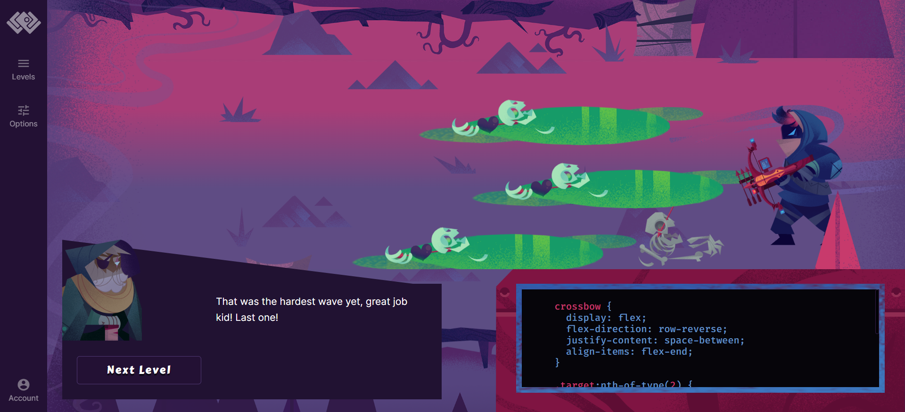
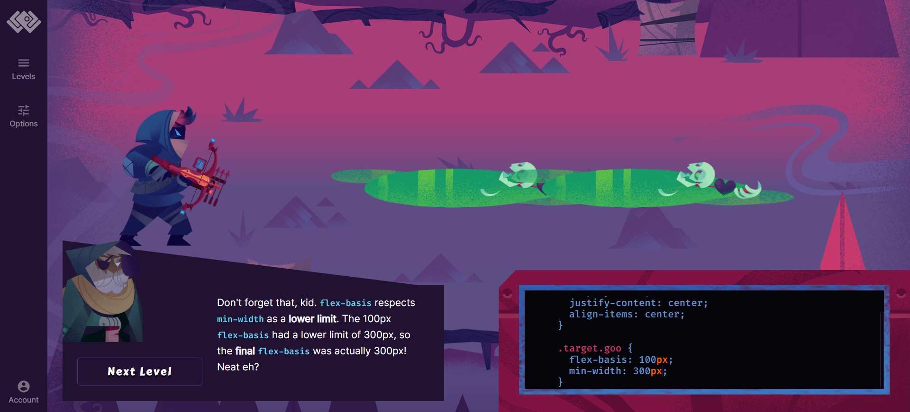
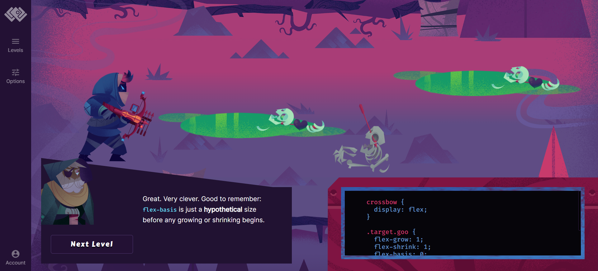
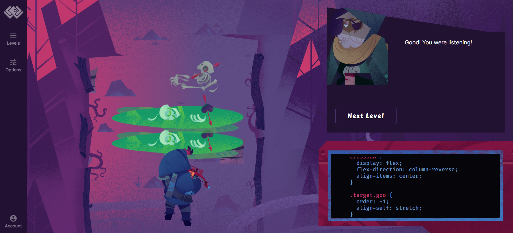
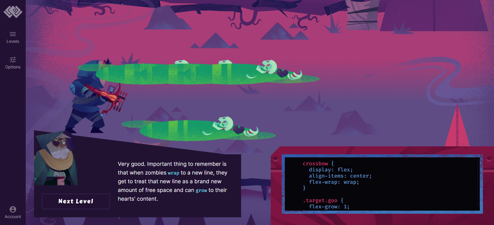

# **flex-direction**
# Nivel 1

---
# Nivel 2

---
# Nivel 3

---
# Nivel 4

---
---
# **justify-content**
# Nivel 1

---
# Nivel 2

---
# Nivel 3

---
# Nivel 4

---
# Nivel 5

---
# Nivel 6

---
# Nivel 7

---
# Nivel 8

---
# Nivel 9

---
# Nivel 10

---
# Nivel 11

---
# Nivel 12

---
# Nivel 13

---
# Nivel 14

---
# Nivel 15

---
# Nivel 16

---
---
# **align-items**
# Nivel 1

---
# Nivel 2

---
# Nivel 3

---
# Nivel 4

---
# Nivel 5

---
# Nivel 6

---
# Nivel 7

---
# Nivel 8

---
# Nivel 9

---
# Nivel 10

---
# Nivel 11

---
# Nivel 12

---
# Nivel 13

---
# Nivel 14

---
# Nivel 15

---
# Nivel 16

---
# Nivel 17

---
---
# **align-self**
# Nivel 1

---
# Nivel 2

---
# Nivel 3

---
# Nivel 4

---
# Nivel 5

---
# Nivel 6

---
# Nivel 7

---
# Nivel 8

---
# Nivel 9

---
# Nivel 10

---
# Nivel 11

---
# Nivel 12

---
# Nivel 13

---
# Nivel 14

---
---
# **flex-grow**
# Nivel 1

---
# Nivel 2

---
# Nivel 3

---
# Nivel 4

---
# Nivel 5

---
# Nivel 6

---
# Nivel 7

---
# Nivel 8

---
# Nivel 9

crossbow {
  display: flex;
  flex-direction: row-reverse;
  justify-content: space-around;
  align-items: center;
}

.target.goo {
  align-self: center;
  align-items: center;
  flex-grow: 1;
}

.target:nth-of-type(1) {
  align-self: flex-end;
  flex-grow: 2;
}

---
# Nivel 10

---
# Nivel 11

---
# Nivel 12

crossbow {
  display: flex;
  flex-direction: row-reverse;
  justify-content: space-between;
  align-items: flex-start;
}

.target.goo {
  flex-grow: 1;
}

.target:nth-of-type(1) {
  flex-grow: 0;
}

.target:nth-of-type(4) {
  flex-grow: 3;
}

---
# Nivel 13

crossbow {
  display: flex;
  flex-direction: column-reverse;
}

.target.goo {
  align-self: center;
  flex-grow: 1;
}

.target:nth-of-type(2) {
  align-self: stretch;
  flex-grow: 1;
}

.target:nth-of-type(3) {
  flex-grow: 0;
}

---
# Nivel 14

crossbow {
  display: flex;
  align-items: flex-end;
}

.target.goo {
 align-self: flex-start;
 flex-grow: 1;
}

.target:nth-of-type(3) {
  align-self: stretch;
}

---
# Nivel 15

crossbow {
  display: flex;
  flex-direction: row-reverse;
  justify-content: space-between;
  align-items: flex-end;
}

.target.goo {
  flex-grow: 1;
}

.target:nth-of-type(4) {
  flex-grow: 3;
}

---
# Nivel 16

---
---
# **flex-shrink**
# Nivel 1

---
# Nivel 2

---
# Nivel 3

---
# Nivel 4

---
# Nivel 5

---
# Nivel 6

---
# Nivel 7

crossbow {
  display: flex;
  justify-content: space-between;
}

.target.goo {
  align-self: flex-start;
  flex-grow: 1;
}

.target.male {
  align-self: center;
}

---
# Nivel 8

crossbow {
  display: flex;
  flex-direction: column;
  align-items: center;
}

.target:nth-of-type(2) {
  align-self: stretch;
}

.target:nth-of-type(3) {
  flex-grow: 1;
  flex-shrink: 0;
}

---
# Nivel 9

crossbow {
  display: flex;
  flex-direction: row-reverse;
  justify-content: space-around;
  align-items: flex-start;
}

.target:nth-of-type(1) {
  align-self: center;
}

.target:nth-of-type(2) {
  align-self: center;
  flex-grow: 1;
  flex-shrink: 0;
}

---
# Nivel 10

---
# Nivel 11

crossbow {
  display: flex;
  justify-content: space-between;
  align-items: flex-start;
}

.target:nth-of-type(2) {
  flex-grow: 2;
  flex-shrink: 1;
}

.target:nth-of-type(3) {
  align-self: stretch;
  flex-grow: 1;
  flex-shrink: 2;
}

---
# Nivel 12

crossbow {
  display: flex;
  flex-direction: column;
  align-items: center;
}

.target:nth-of-type(1) {
  flex-shrink: 2;
}

.target:nth-of-type(2) {
  flex-grow: 1;
  flex-shrink: 0;
}

---
# Nivel 13

crossbow {
  display: flex;
  flex-direction: column-reverse;
}

.target.goo {
  
}

.target:nth-of-type(1) {
  align-self: flex-end;
  flex-grow: 1;
}

.target:nth-of-type(2) {
  flex-grow: 1;
  flex-shrink: 2;
}

.target:nth-of-type(3) {
  align-self: flex-start;
  flex-grow: 2;
  flex-shrink: ;
}

# Nivel 14

crossbow {
  display: flex;
  justify-content: space-between;
  align-items: flex-end;
}

.target.goo {
  align-self: flex-start;
  flex-grow: 1;
}

.target:nth-of-type(1) {
  flex-shrink: 0;
  flex-grow: 3;
}

---
# Nivel 15

crossbow {
  display: flex;
  flex-direction: row-reverse;
  justify-content: space-between;
  align-items: flex-end;
}

.target:nth-of-type(2) {
  align-self: stretch;
  flex-grow: 2;
  flex-shrink: 2;
}

.target:nth-of-type(3) {
  align-self: flex-start;
  flex-grow: 1;
  flex-shrink: 0;
}

---
# Nivel 16

crossbow {
  display: flex;
  flex-direction: column;
  align-items: flex-end;
}

.target:nth-of-type(1) {
  align-self: stretch;
  flex-shrink: 0;
}

.target:nth-of-type(2) {
  align-self: stretch;
  flex-grow: 1;
}

---
---
# **flex-basis**
# Nivel 1

---
# Nivel 2

---
# Nivel 3

---
# Nivel 4

---
# Nivel 5

---
# Nivel 6

---
# Nivel 7

---
# Nivel 8

---
# Nivel 9

---
# Nivel 10

---
# Nivel 11

---
# Nivel 12

---
# Nivel 13

---
# Nivel 14

crossbow {
  display: flex;
  justify-content: flex-start;
  align-items: center;
}

.target.goo {
  flex-basis: 50%;
}

.target:nth-of-type(3) {
  align-self: stretch;
}

---
# Nivel 15

crossbow {
  display: flex;
  justify-content: space-between;
  align-items: flex-end;
}

.target.goo {
  align-self: center;
  flex-grow: 1;
}

.target:nth-of-type(3) {
  align-self: flex-start;
  flex-grow: 0;
  flex-basis: 75px;
}

---
# Nivel 16

crossbow {
  display: flex;
  flex-direction: column-reverse;
  align-items: center;
}

.target.goo {
  flex-grow: 1;
}

.target:nth-of-type(2) {
  max-width: none;
  max-height: 200px;
}

---
# Nivel 17

crossbow {
  display: flex;
  justify-content: center;
  align-items: center;
}

.target.goo {
  flex-basis: 200px;
}

.target:nth-of-type(1) {
  flex-shrink: 0;
}

.target:nth-of-type(2) {
  flex-basis: 200px;
  min-width: 300px;
}

---
# Nivel 18

crossbow {
  display: flex;
  flex-direction: column;
  justify-content: flex-start;
  align-items: flex-start;
}

.target.goo {
  flex-basis: 250px;
}

.target:nth-of-type(1) {
  flex-shrink: 0;
}

---
# Nivel 19

crossbow {
  display: flex;
  justify-content: flex-end;
  align-items: center;
}

.target.goo {
  flex-basis: 200px;
}

.target:nth-of-type(2) {
  flex-shrink: 0;
}

---
# Nivel 20

crossbow {
  display: flex;
}

.target.goo {
  flex-grow: 1;
  flex-shrink: 1;
  flex-basis: 0;
}

.target:nth-of-type(3) {
  align-self: flex-start;
}

---
---
# **order**
# Nivel 1

---
# Nivel 2

---
# Nivel 3

---
# Nivel 4

---
# Nivel 5

---
# Nivel 6

crossbow {
  display: flex;
  justify-content: center;
  align-items: center;
}

.target.female {
  order: 1;  
}

.target.goo {
  order: 2;
}

.target.male {
  order: 3;
}

---
# Nivel 7

crossbow {
  display: flex;
  justify-content: flex-end;
  align-items: flex-start;
}

.target.goo {
  order: -1;
  align-self: stretch;
  flex-grow: 1;
}

---
# Nivel 8

crossbow {
  display: flex;
  flex-direction: row-reverse;
  justify-content: center;
  align-items: flex-start;
}

.target.goo {
  order: 1;
  align-self: flex-end;
  flex-basis: 350px;
}

---
# Nivel 9

---
# Nivel 10

---
# Nivel 11

crossbow {
  display: flex;
  justify-content: space-around;
  align-items: center;
}

.target.female {
  order: 2;
}
  
.target.goo {
  order: 3;
}

.target.male {
  order: 1;
}

---
# Nivel 12

crossbow {
  display: flex;
  align-items: center;
}

.target.goo {
  order: 2;
  flex-grow: 1;
}
  
.target.male {
  order: 1;
}

---
# Nivel 13

crossbow {
  display: flex;
  justify-content: space-between;
  align-items: flex-start;
}

.target.female {
  order: -1;
}
  
.target:nth-of-type(1) {
  align-self: flex-end;
  flex-grow: 1;
  flex-shrink: 0;
}

---
---
# **flex-wrap**
# Nivel 1

---
# Nivel 2

---
# Nivel 3

---
# Nivel 4

---
# Nivel 5

---
# Nivel 6

---
# Nivel 7

---
# Nivel 8

---
# Nivel 9

---
# Nivel 10

---
# Nivel 11

crossbow {
  display: flex;
  align-items: center;
  justify-content: flex-start;
  flex-wrap: wrap;
  flex-basis: 50%;
}

.target.goo {
  flex-basis: 50%;
}

---
# Nivel 12

---
# Nivel 13

---
# Nivel 14

---
# Nivel 15

crossbow {
  display: flex;
  justify-content: flex-start;
  align-items: flex-start;
  flex-wrap: wrap;
}

.target:nth-of-type(2) {
  flex-grow: 1;
}

.target:nth-of-type(3) {
  flex-grow: 1;
}

---
---