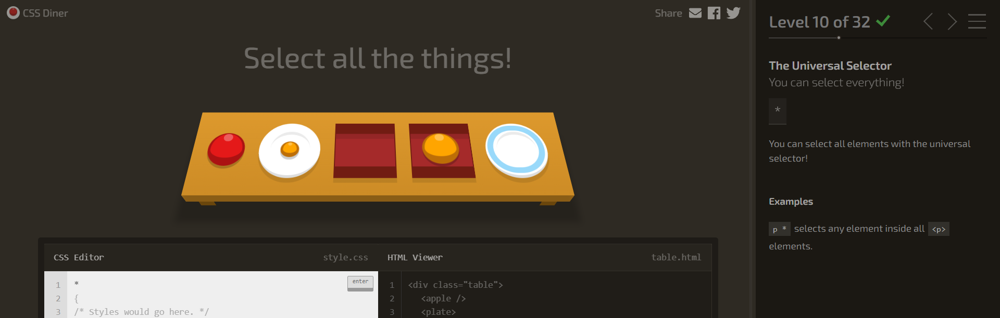
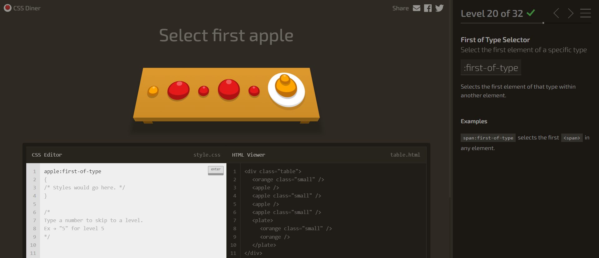

# **Nivel 1**

plate

---
---
# **Nivel 2**

bento

---
---
# **Nivel 3**

#fancy

---
---
# **Nivel 4**

plate apple

---
---
# **Nivel 5**

#fancy pickle

---
---
# **Nivel 6**

.small

---
---
# **Nivel 7**

orange.small

---
---
# **Nivel 8**

bento orange.small

---
---
# **Nivel 9**

plate, bento

---
---
# **Nivel 10**

\*

---
---
# **Nivel 11**

plate \*

---
---
# **Nivel 12**

plate + apple

---
---
# **Nivel 13**

bento ~ pickle

---
---
# **Nivel 14**

plate > apple

---
---
# **Nivel 15**

orange:first-child

---
---
# **Nivel 16**

apple:only-child, plate pickle:only-child

---
---
# **Nivel 17**

apple:last-child, pickle:last-child

---
---
# **Nivel 18**

plate:nth-child(3)

---
---
# **Nivel 19**

bento:nth-last-child(3)

---
---
# **Nivel 20**

apple:first-of-type

---
---
# **Nivel 21**

plate:nth-of-type(even)

---
---
# **Nivel 22**

plate:nth-of-type(2n+3)

---
---
# **Nivel 23**

plate apple:only-of-type

---
---
# **Nivel 24**

orange:last-of-type, apple:last-of-type

---
---
# **Nivel 25**

bento:empty

---
---
# **Nivel 26**

apple:not(.small)

---
---
# **Nivel 27**

[for]

---
---
# **Nivel 28**

plate[for]

---
---
# **Nivel 29**

[for="Vitaly"]

---
---
# **Nivel 30**

[for^="Sa"]

---
---
# **Nivel 31**

[for$="ato"]

---
---
# **Nivel 32**

[for*="obb"]

---
---