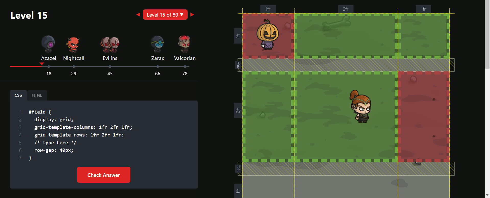
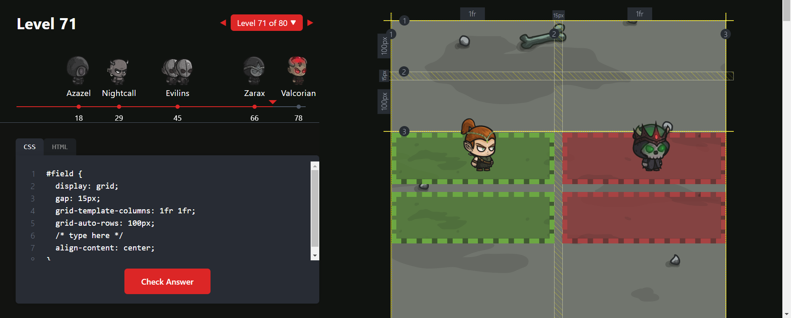

# **Nivel 1**

---
# **Nivel 2**

---
# **Nivel 3**

---
# **Nivel 4**

---
# **Nivel 5**

---
# **Nivel 6**

---
# **Nivel 7**

---
# **Nivel 8**

---
# **Nivel 9**

---
# **Nivel 10**

---
# **Nivel 11**

---
# **Nivel 12**

---
# **Nivel 13**

---
# **Nivel 14**

---
# **Nivel 15**

---
# **Nivel 16**

---
# **Nivel 17**

---
# **Nivel 18**

---
# **Nivel 19**

---
# **Nivel 20**

---
# **Nivel 21**

---
# **Nivel 22**

---
# **Nivel 23**

---
# **Nivel 24**

---
# **Nivel 25**

---
# **Nivel 26**

---
# **Nivel 27**

#field {
  display: grid;
  /* type here */
  grid-template-columns: 1fr 1fr 1fr 1fr;
  grid-template-rows: 1fr 1fr 1fr 1fr;
  gap: 15px;
}

#redLand {
  /* type here */
  grid-column-start: 2;
  grid-column-end: 4;
  grid-row-start: 3;
  grid-row-end: 5;
}

---
# **Nivel 28**

---
# **Nivel 29**

---
# **Nivel 30**

---
# **Nivel 31**

#field {
  display: grid;
  /* type here */
  grid-template-rows: 1fr 1fr 1fr 1fr;
  grid-template-columns: 1fr 2fr 1fr;
  gap: 15px;
  grid-template-areas: "r r g" "r r g" "r r g"
  "n n g";
}

#greenLand {
  /* type here */
  grid-area: g;
}

#redLand {
  /* type here */
  grid-area: r;
}

---
# **Nivel 32**

#field {
  display: grid;
  /* type here */
  grid-template-rows: 1fr 1fr 1fr;
  grid-template-columns: 1fr 1fr 1fr;
  grid-template-areas: "g g n" "g g n" "r r r";
  gap: 15px 10px;
}

#greenLand {
  /* type here */
  grid-area: g;
}

#redLand {
  /* type here */
  grid-area: r;
}

---
# **Nivel 33**

---
# **Nivel 34**

---
# **Nivel 35**

---
# **Nivel 36**

---
# **Nivel 37**

---
# **Nivel 38**

#field {
  display: grid;
  /* type here */
  grid-template-rows: 1fr 1fr;
  grid-template-columns: minmax(min-content, 200px) 150px
}

---
# **Nivel 39**

#field {
  display: grid;
  /* type here */
  grid-template-rows: 1fr 1fr;
  grid-template-columns: minmax(max-content, 200px) minmax(min-content, auto)
}

---
# **Nivel 40**

---
# **Nivel 41**

#field {
  display: grid;
  /* type here */
  grid-template-columns: repeat(auto-fit, minmax(150px, 1fr));
  gap: 15px;
}

---
# **Nivel 42**

#field {
  display: grid;
  /* type here */
  grid-template-columns: repeat(auto-fit, minmax(100px, 1fr));
  column-gap: 15px;
}

---
# **Nivel 43**

---
# **Nivel 44**

#field {
  display: grid;
  /* type here */
  gap: 15px;
  grid-template-areas: "r r r" "n g g" "n g g";
}

#greenLand {
  /* type here */
  grid-area: g;
}

#redLand {
  /* type here */
  grid-area: r;
}

---
# **Nivel 45**

#field {
  display: grid;
  /* type here */
  gap: 15px;
  grid-template-rows: 100px 200px 1fr;
  grid-template-columns: repeat(3, 1fr);
  grid-template-areas: "r r n" "b g g" "b g g";
}

#greenLand {
  /* type here */
  grid-area: g;
}

#redLand {
  /* type here */
  grid-area: r;
}

#blueLand {
  /* type here */
  grid-area: b;
}

---
# **Nivel 46**

---
# **Nivel 47**

---
# **Nivel 48**

#field {
  display: grid;
  /* type here */
  grid-template-rows: repeat(4, 1fr);
  grid-template-columns: repeat(4, 1fr);
  grid-auto-flow: column;
  gap: 15px;
}
  
#greenLand {
  grid-column-end: span 3; 
}

---
# **Nivel 49**

---
# **Nivel 50**

---
# **Nivel 51**

---
# **Nivel 52**

---
# **Nivel 53**

---
# **Nivel 54**

---
# **Nivel 55**

---
# **Nivel 56**

---
# **Nivel 57**

---
# **Nivel 58**

---
# **Nivel 59**

#field {
  display: grid;
  /* type-here */
  grid-template-rows: 1fr 1fr;
  grid-template-columns: 2fr 1fr 1fr;
  justify-items: center;
  align-items: center;
}

#field > div {
  height: 50%;
  width: 50%;
  
}

#greenLand {
  /* type-here */
  grid-column: span 2;
}

---
# **Nivel 60**

---
# **Nivel 61**

---
# **Nivel 62**

---
# **Nivel 63**

#field {
  display: grid;
  /* type here */
  grid-template-rows: 1fr 1fr;
  grid-template-columns: 200px 1fr;
  gap: 15px;
}

.redLand {
  /* type here */
  width: 50%;
  height: 50%;
  justify-self: end;
}

---
# **Nivel 64**

#field {
  display: grid;
  /* type here */
  grid-template-rows: 1fr 2fr;
  grid-template-columns: 1fr 2fr;
  gap: 15px;
}

.redLand {
  /* type here */
  height: 50%;
  align-self: center;
}

---
# **Nivel 65**

#field {
  display: grid;
  /* type here */
  grid-template-rows: repeat(3, 1fr);
  grid-template-columns: repeat(3, 1fr);
  
}

.redLand {
  /* type here */
  height: 50%;
  align-self: end;
}

---
# **Nivel 66**

#field {
  display: grid;
  gap: 15px;
  grid-template: 1fr 1fr / 2fr 1fr;
  /* type here */
  justify-items: center;
  align-items: center;
}

#field > div {
  height: 50%;
  width: 50%;
  
}

#redLand {
  /* type here */
  justify-self: end;
  align-self: end;
}

#greenLand {
  /* type here */
  justify-self: start;
  align-self: end;
}

---
# **Nivel 67**

#field {
  display: grid;
  /* type here */
  grid-template-rows: 1fr 1fr 1fr;
  grid-template-columns: 2fr 1fr;
}

#field > div {
  height: 50%;
  width: 50%;
  
}

#redLand {
  /* type here */
  
}

#greenLand {
  /* type here */
  place-self: start end;
}

---
# **Nivel 68**

---
# **Nivel 69**

---
# **Nivel 70**

---
# **Nivel 71**

---
# **Nivel 72**

---
# **Nivel 73**

---
# **Nivel 74**

#field {
  display: grid;
  /* type here */
  grid-template-rows: repeat(4, 1fr);
  grid-template-columns: repeat(4, 1fr);
  gap: 15px;
}

#greenLand {
  /* type here */
  grid-row: 2 / 5;
  grid-column: 2 / 4;
}

---
# **Nivel 75**

#field {
  display: grid;
  /* type here */
  grid-template-rows: repeat(3, 1fr);
  grid-template-columns: repeat(3, 1fr);
  grid-template-areas: "g g b" "g g b" "r r r";
  gap: 15px 10px;
}

#greenLand {
  /* type here */
  grid-area: g;
}

#redLand {
  /* type here */
  grid-area: r;
}

#blueLand {
  /* type here */
  grid-area: b;
}

---
# **Nivel 76**

---
# **Nivel 77**

#field {
  display: grid;
  grid-template-columns: repeat(auto-fill, 1fr);
  /* type here */
  gap: 15px;
  grid-auto-rows: 100px;
  align-content: space-between;
}

#field div:nth-child(3n) {
  /* type here */
  grid-row: span 1;
  grid-column: span 3;
}

---
# **Nivel 78**

#field {
  /* type here */
  grid-template-rows: 1fr 1fr;
  grid-template-columns: 100px 1fr 1fr;
  gap: 15px;
  grid-auto-flow: column;
}

#greenLand {
  /* type here */
  grid-row: span 2;
}

#redLand {
  /* type here */
  grid-row: 2;
}

#blueLand {
  /* type here */
  height: 50%;
  align-self: center;
}

---
# **Nivel 79**

#field {
  /* type here */
  grid-template-rows: repeat(4, 1fr);
  grid-template-columns: repeat(4, 1fr);
  gap: 15px;
}

#greenLand {
  /* type here */
  grid-row-start: 3;
  grid-row-end: 5;
  grid-column-start: 2;
  grid-column-end: 5;
}

#redLand {
  /* type here */
  grid-row-start: 1;
  grid-row-end: 4;
  grid-column-start: 3;
  grid-column-end: 5;
}

---
# **Nivel 80**

#field {
  /* type here */
  display: grid;
  grid-template-columns: repeat(3, 1fr);
}

#greenLand {
  /* type here */
  grid-row: 1 / 2;
  grid-column: 1 / 3;
}

#redLand {
  /* type here */
  grid-row: 1 / 3;
  grid-column: 2 / 4;
}

#blueLand {
  /* type here */
  grid-row: 1 / 5;
  grid-column: 2;
}